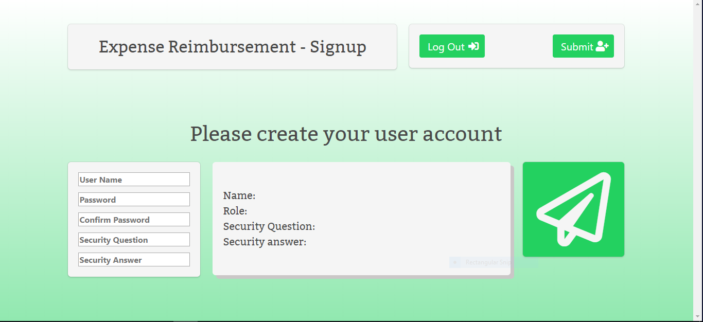

# Project-1 - Full stack web application with a Java back-end
## An expense reimbursement system

-----------
### Technologies to be implemented in final project
- Java 1.8
- Servlets
- JDBC
- PL/SQL
- HTML
- CSS
- Javascript
- Bulma (Bootstrap replacement)
- AJAX
- JUnit
- log4j

-----------
### Environment
- Tomcat Server
- Oracle Database
- AWS
- Eclipse/Spring Tools Suite
- SQL Developer